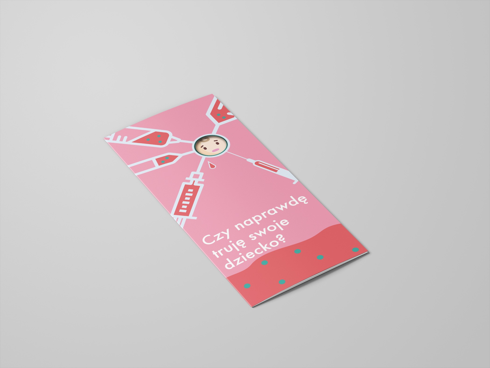
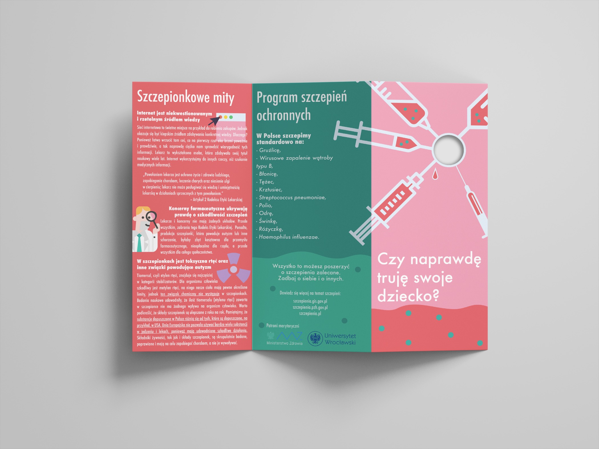
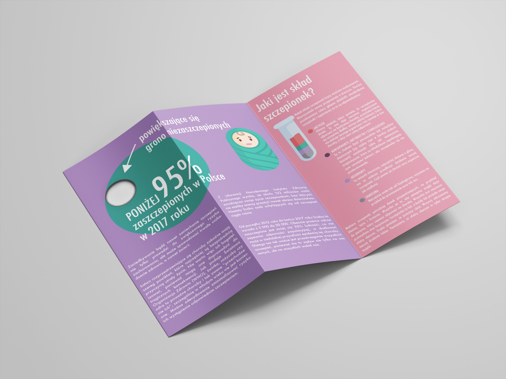

This project was about information researching based on the topic presented by our lecturer. The main goal of this assignment was to create a leaflet about vaccinations. In 2017 there was a huge discussion about the anti-vaccination movement. 2 years later the number of not vaccinated people for obligatory vaccines went to above 50 000 children. In a team of 5, we had prepared a report about what typical internet user could find about vaccinations. Based on our research, we prepared a copy and leaflet that could be distributed by the ministry of health. In this project, I was in charge of the parts of the report and layout of the leaflet. My favourite thing about this project is that we decided to not scare people but to explain the myths about vaccinations. The use of pastel colours is intended not to be provocative but more soothing, as in many anti-vaccination materials it appeared to be aggressive. Also the nifty usage of a cut in the leaflet in an element of surprise that represents the percentage of people that do not protect their children. 

The report is available [here](https://drive.google.com/file/d/1R9LE47nmDFUS4VO_KIoXbpjUaP2oH_Aq/view?usp=sharing) (in Polish).

