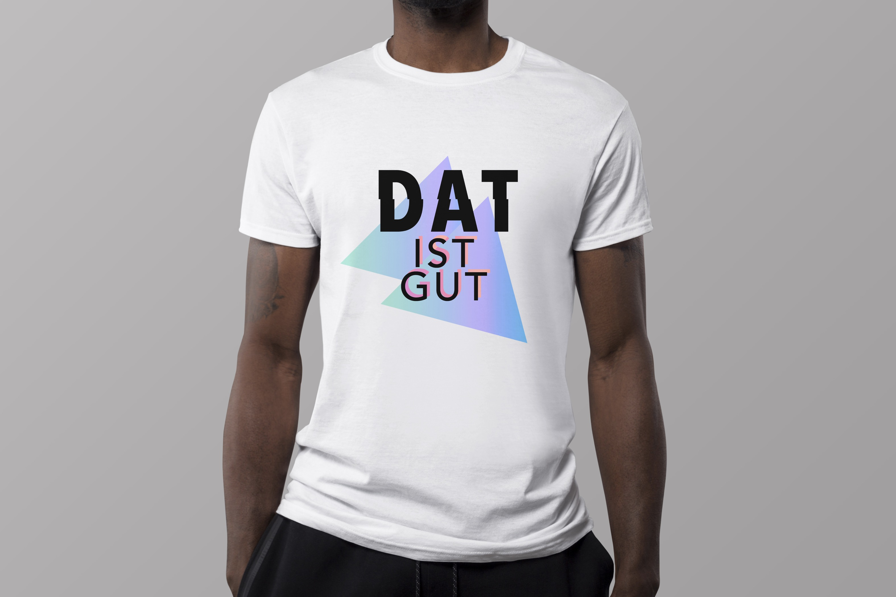

*DAT ist gut* was the second year exhibition prepared with all of the students from my degree. The Exhibition was held in the main building of the university for 3 days. For the propose of this event, I created visual identity including posters and a t-shirt.

DAT stands for **D**igital **A**rt (and) **T**echnology which is the name of my bachelor's degree. We came up with this witty bilingual name after the second year’s trip to Germany. All of the graphical design prepared for this event was created by me.

