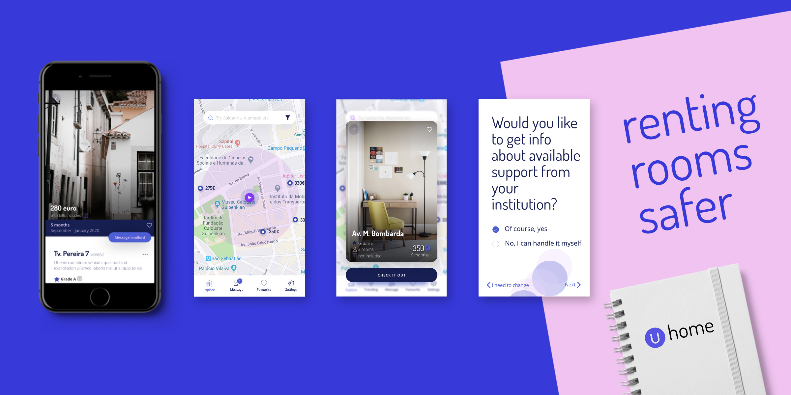
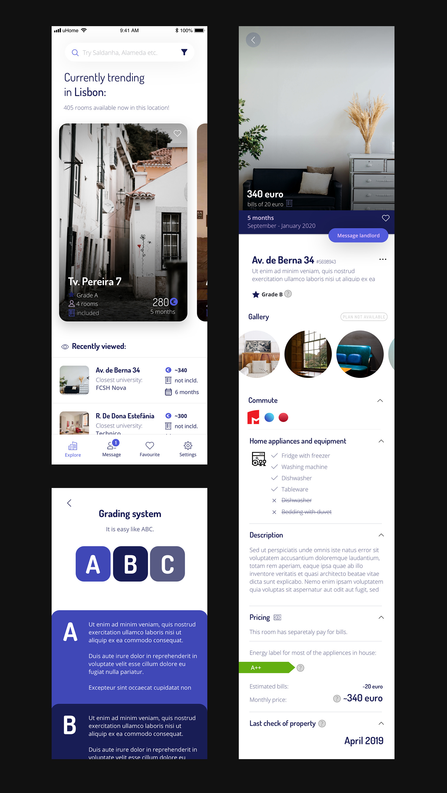
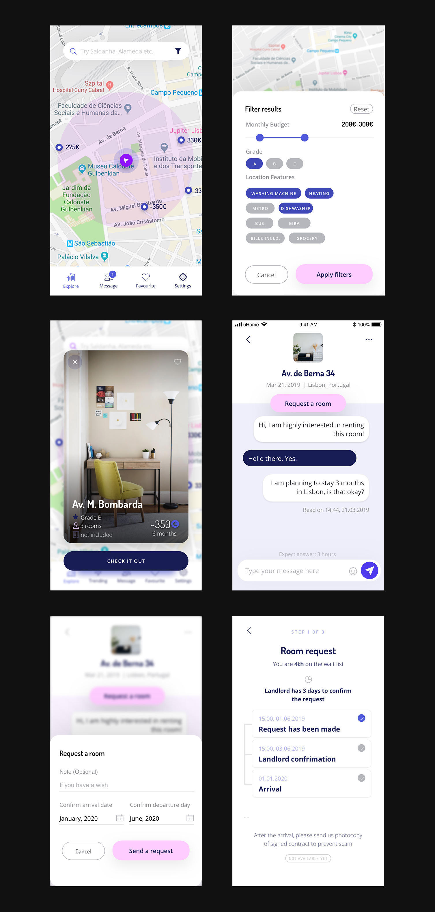
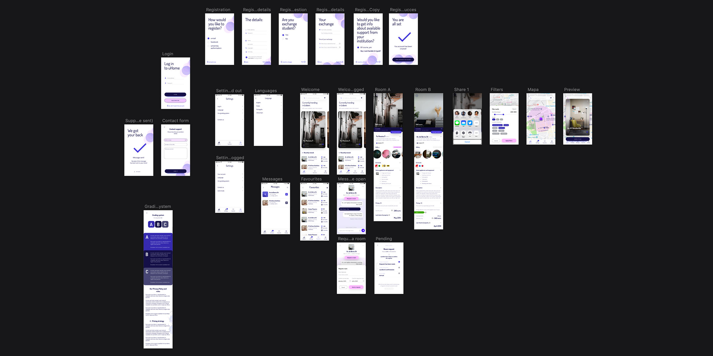

uHome is an idea of a platform that provides affordable rooms for students with a good price to quality ratio. The mission of uHome is to prevent scams, help international students with moving to a new country and fight with overpriced houses; especially those ones that do not represent the real price of a place. The initial vision is to create a stable platform (an app) that connects students, landlords, and universities. With uHome users could get a safe place to live for a temporary time.

The room listing market is mostly dominated by OLX, gumtree, and physical advertisement in shops by leaving notes in supermarkets, etc. A great number of room ads are carried by the word of mouth; between people. Room searching works in a period of life that takes about 5 to 10 years. After that, it goes to flat renting or buying a property. Many room listing pages are not clear and providing not clear information and hidden fees. The design was based on a template in the Sketch App. 

The idea of this kind of app was based on my friends and own experience of living abroad for a quite of time. I have been living in the UK and Portugal, also I have met a lot of people that had such a fascinating accommodation experience in European countries. The most neglected thing about accommodation websites is that they lack a key factor in the genuineness of posted adverts. Each semester, universities are run out of places in halls of residence that are perceived as „safe and checked places”. Many international students are coming to popular exchange places (like Lisbon, Wrocław, Warsaw, or Berlin) and because of a variety of languages in Europe, it is very common for the language barrier to occur. Also, for many young people, it is the first time to live on their own. uHome could provide additional places for students, that are checked by an internal team, confirmed that they are real, with descriptions provided in at least two languages. 

